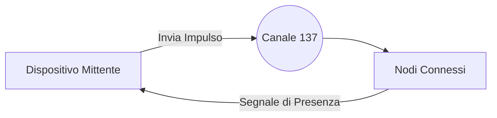

  <h1>MICROBIT RADIO V3</h1>
  
<strong>Protocollo Avanzato di Sincronizzazione e Comunicazione Radio per sistemi embedded.</strong>

  
  

    
    
    
    
    
  

   

  <em>Scambio rapido di messaggi, identificazione visiva dei nodi e quantificazione HUD online.</em>
  

 

---

## Struttura della Rete

La rete funziona come un Hub centrale. Lo schema illustra in modo lineare il processo di identificazione degli utenti connessi:

> [!TIP]
> **Lettura Semplificata:** Il mittente interroga il canale, i dispositivi adiacenti che ascoltano inviano un pacchetto di conferma, garantendo l'aggiornamento costante della conta utenti in tempo reale.

---

## Panoramica delle Funzionalità

<b>HUD (Heads-Up Display) a Barre</b>

 

Le librerie integrate consentono di trasformare lo schermo in un indicatore a barre verticali o orizzontali. I LED si accendono progressivamente per indicare quante schede (hardware testati fino a 20 utenze) comunicano nell'infrastruttura condivisa.

<b>Profilazione VIP e Output Acustico</b>

 

Identificativi pre-registrati godono di logiche di eccezione in cui la normale stampa degli eventi viene arrestata temporaneamente. Il micro_bit procede alla renderizzazione di un simbolo dedicato su matrice associandolo alla riproduzione parallela di file sonori in background.

<b>Gestione Flusso Testuale Prioritario</b>

 

Messaggistiche asincrone sospendono le attività di default. Garantendo il trasferimento orizzontale automatico dei caratteri sullo schermo previene la mancata lettura manuale tra un loop visivo e l'altro.

---

## Controlli Hardware

Mappatura dei pattern di inserimento tramite interattori fisici e relative conseguenze a display.

| Ingresso Fisico | Azione di Rete | Conseguenza sul Display |
| :---: | :--- | :--- |
| <kbd>A</kbd> | Invio Trasmissione Unilaterale | Risoluzione in fade-in dei loghi associati in board riceventi specifiche. |
| <kbd>A</kbd> + <kbd>B</kbd> | Interrogazione Broad Globale | Reset e ridisegno scalare della matrice alla conta dei ritorni positivi. |
| <kbd>B</kbd> | Accesso Interfaccia Dati | Rendering in tempo reale delle utenze aggregate via calcoli proporzionali per pixel. |

---

## Moduli MakeCode

Le configurazioni d'ambiente interne (`ptx.json`) si affidano a quattro core esterni.

1. `radio`: Connettività base ad antenna.
2. `microphone`: Interfacciamenti coi segnali input audio ambientali.
3. `radio-broadcast`: Ampliamento del comparto trasmissioni a pacchetto rapido.
4. `microturtle`: Algoritmo a griglia interpolata indispensabile per le funzioni HUD visive di questo protocollo.

---

## Prerequisiti Base per l'Uso

> [!WARNING]
> Condizione vincolante all'esecuzione corretta dell'infrastruttura è l'**abilitazione manuale nel codice sorgente**.

Per fare in modo che la scheda operi correttamente come nodo attivo e possa trasmettere messaggi all'interno del progetto, l'utente *deve* modificare manualmente una specifica variabile identificativa all'interno del codice sorgente di base (configurazione del block TypeScript). 
In mancanza di questo intervento editoriale, la board interpreterà parzialmente la direttiva ed eliminerà la propria interfaccia d'uscita dai cicli generici in radio frequenza.

---

> [!NOTE]
> Progetto compilato, scritto e architettato interamente da **[pgiudici13](https://github.com/pgiudici13)**. 
> Sviluppato per fini di test su interconnessioni hardware e limitazioni di protocollo custom basate su architetture standard e embedded.
