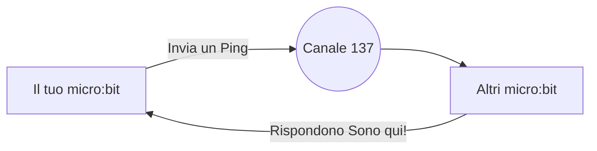
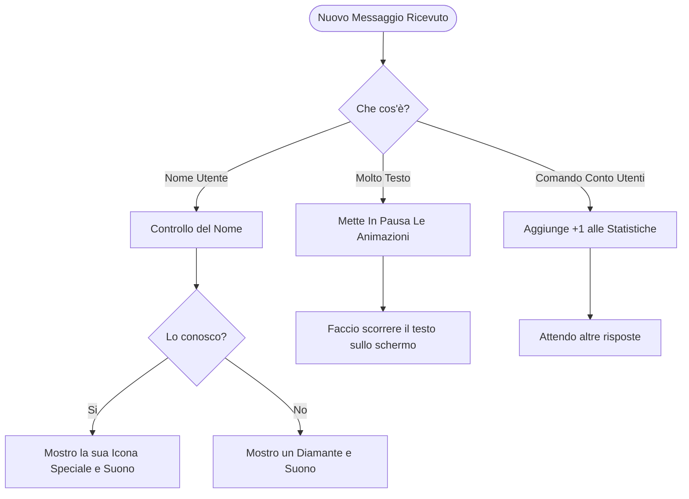
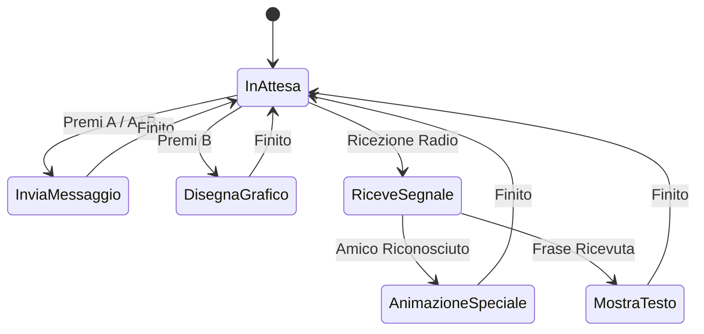
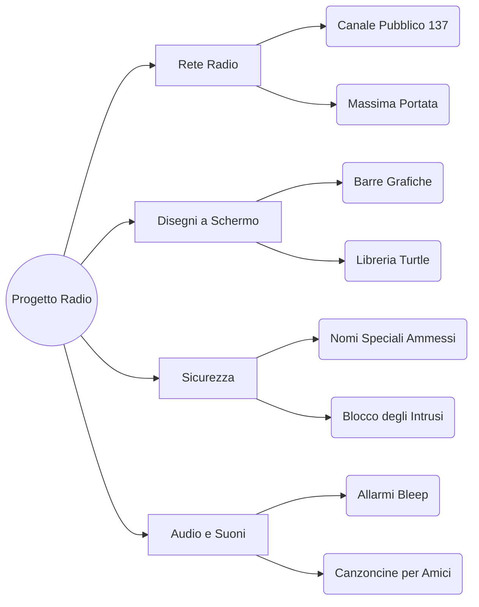

  <h1>MICROBIT RADIO V3</h1>
  
<strong>Un sistema semplice e avanzato per comunicare e sincronizzare vari micro:bit via Radio.</strong>

  
  

    
    
  

  

    
    
    
    
    
    
  

   

  <em>Scambio di messaggi, icone personalizzate per utente e un grafico in tempo reale dei dispositivi online.</em>
  

 

---

## Come Funziona la Rete

Il sistema funziona in modalità ad-hoc: tutti i micro:bit comunicano direttamente uno con l'altro. Non c'è un server, tutti possono trasmettere e ricevere messaggi direttamente sullo stesso canale radio.

> [!TIP]
> **Cosa significa?** Quando "interroghi" la rete, tutti gli altri dispositivi nelle vicinanze ti rispondono in automatico. Così il tuo schermo si aggiorna e ti mostra esattamente quante persone sono collegate!

---

## Gestione dei Messaggi

Quando il micro:bit riceve un segnale, analizza rapidamente di cosa si tratta e decide l'azione più giusta da compiere, come mostrato qui sotto:

---

## Gli Stati del micro:bit

In ogni momento, la scheda si trova in una modalità specifica per evitare di bloccarsi o mostrare schermate sbagliate sulle luci LED:

---

## Struttura del Progetto (Mappa delle Funzionalità)

Ecco uno schema semplice diviso per categorie che riassume tutto ciò di cui si occupa il codice di RadioV3:

<b>Dettaglio delle Funzioni Più Belle</b>

 

* **Grafico a Barre**: Accende i LED colonna per colonna per contare fisicamente i ritorni (fino a 20 schede collegate senza sovrapporsi).
* **Icone Personalizzate**: Se il sistema capisce che si è connesso un identificativo conosciuto, fa partire una sua animazione unica con tanto di colonna sonora in sottofondo.
* **Priorità al Testo**: Se ricevi un testo lungo, lo scorrimento ha la precedenza assoluta, disattivando qualsiasi altro disegno sulla lavagna LED per non farti perdere il messaggio.

---

## Uso dei Pulsanti

Cosa succede quando premi i bottoni fisici sulla scocca del micro:bit.

| Pulsante | Azione | Cosa succede sullo schermo |
| :---: | :--- | :--- |
| <kbd>A</kbd> | Invia Saluto | Invia un saluto alla rete. Tutti vedranno un diamante, o un'animazione speciale se sei un profilo VIP. |
| <kbd>A</kbd> + <kbd>B</kbd> | Conta Utenti | Azzera il display e lancia il controllo radio per vedere chi c'è in giro. |
| <kbd>B</kbd> | Aggiorna Schermo | Ridisegna il grafico dal vivo in base all'ultimo "Conta Utenti" effettuato. |

---

## Librerie Usate

Per far funzionare il codice (`ptx.json`) ci appoggiamo a librerie esterne molto comode:

1. `radio`: Che abilita l'antenna principale.
2. `radio-broadcast`: Per far viaggiare rapidi i messaggi a tutto il gruppo, non solo ad una persona.
3. `microturtle`: Una libreria speciale che permette di usare lo schermo dei LED come se fosse un piano da disegno per il nostro grafico a barre.

---

## Da fare prima di usarlo...

> [!NOTE]
> **Tutti possono partecipare!** A differenza delle versioni precedenti, ora chiunque può inviare e ricevere messaggi e far parte del conteggio HUD senza configurazioni.

Tuttavia, se vuoi sbloccare le **funzioni VIP** (un'icona speciale dedicata e una campanella d'avviso personalizzata quando ti connetti), puoi aprire una discussione su GitHub indicando il nome del tuo micro:bit e ti aggiungeremo alla lista ufficiale nel codice!

---

## Link Utili e Accesso Veloce

Se vuoi accedere istantaneamente al codice o visualizzare l'interfaccia dedicata: 

* [**Sito Web del Progetto**](https://pgiudici13.github.io/MicrobitRadiov3/) - Pagina ufficiale ospitata su GitHub Pages.
* [**Importa in MakeCode**](https://makecode.microbit.org/#github:pgiudici13/MicrobitRadiov3) - Clicca qui per aprire in automatico la mappa di blocchi logici del programma direttamente sul sito ufficiale di Microsoft MakeCode.

---

> [!NOTE]
> Progetto compilato, scritto e pensato interamente da **[pgiudici13](https://github.com/pgiudici13)**. 
> Sviluppato per fini didattici e per capire come far comunicare piccole schede intelligenti con la minor fatica possibile.
