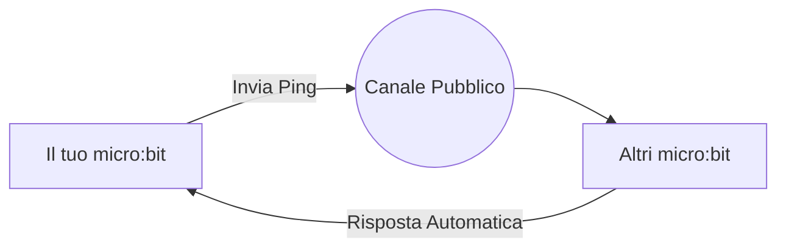
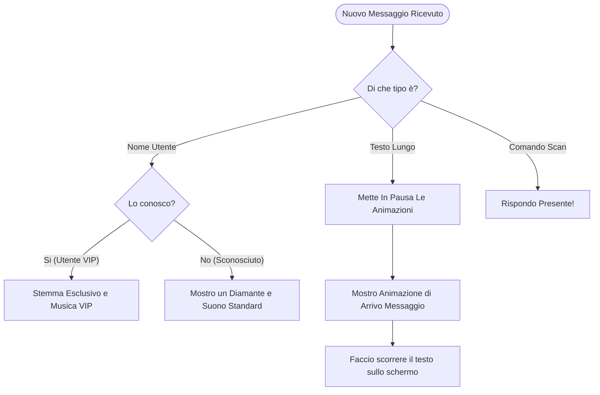
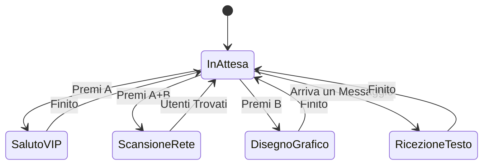
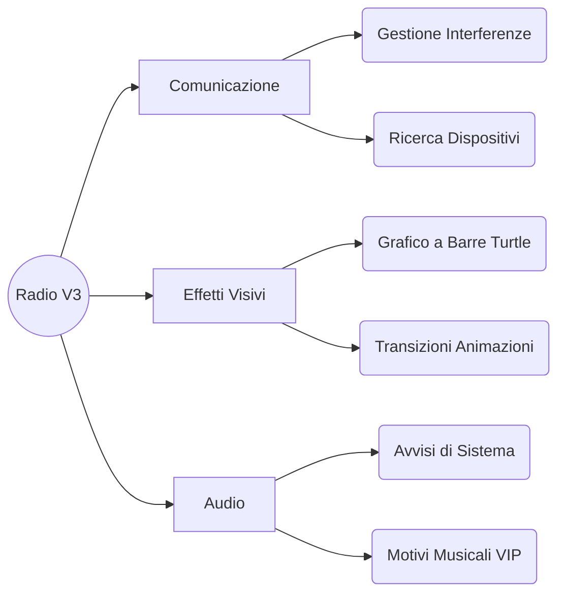

  <h1>MICROBIT RADIO V3</h1>
  
<strong>Un sistema semplice e avanzato per comunicare e sincronizzare vari micro:bit via Radio.</strong>

  
  

    
    
  

  

    
    
    
    
    
    
  

   

  <em>Scambio di messaggi, identificazione utenti e un grafico in tempo reale dei dispositivi online (fino a 20 utenti!).</em>
  

 

---

## Come Funziona la Rete

Il sistema funziona in modalità "ad-hoc": tutti i micro:bit comunicano direttamente uno con l'altro. Non c'è un server o ruter centrale; tutti possono trasmettere e ricevere messaggi direttamente sullo stesso canale radio.

> [!TIP]
> **Cosa significa?** Quando chiedi chi c'è in giro, tutti gli altri dispositivi vicini ti rispondono automaticamente. Così il tuo micro:bit impara esattamente quanti amici sono collegati in quel momento!

---

## Gestione dei Messaggi

Quando il micro:bit riceve un segnale, analizza rapidamente di cosa si tratta e agisce di conseguenza offrendo un feedback visivo e uditivo:

---

## Gli Stati del micro:bit

La scheda utilizza un rigoroso sistema di "stati" per capire cosa sta facendo in ogni momento. Questo evita crash o sovrapposizioni visive quando si premono troppi tasti insieme:

---

## Struttura del Progetto (Mappa delle Funzionalità)

Ecco uno schema semplice diviso per categorie che riassume tutto ciò di cui si occupa il programma:

<b>Dettaglio delle Funzioni Più Belle</b>

 

* **Grafico HUD Potenziato**: Grazie a precisi calcoli matematici, la sezione "Grafico a Barre" accende dinamicamente una barra di luci alla volta. Ora supporta **fino a 20 utenti contemporanei** visualizzati elegantemente sui LED.
* **Profili Personalizzati (VIP)**: Se la tua scheda ha un nome speciale riconosciuto (come *geget*, *zotap*, o *gagez*), il sistema attiverà una firma visiva e sonora unica quando saluti gli altri!
* **Ricezione Testo Protetta**: Quando un utente ti invia una lunga frase di testo, il micro:bit fa partire un rapido suono di avviso e una piccola animazione per catturare la tua attenzione prima di far scorrere la scritta.

---

## Uso dei Pulsanti

Cosa succede quando premi i bottoni fisici sulla scocca del micro:bit. Non ci sono impostazioni complicate: bastano tre azioni.

| Pulsante | Azione | Cosa succede sullo schermo |
| :---: | :--- | :--- |
| <kbd>A</kbd> | **Invia Saluto** | Dici "Ciao" alla rete. Trasmetti il tuo ID e fai accendere lo schermo degli altri (o mostri il tuo stemma VIP). |
| <kbd>A</kbd> + <kbd>B</kbd> | **Scan della Rete** | Avvia un'animazione di radar a tutto schermo. Manda un ping e aspetta le risposte per contare chi c'è online. |
| <kbd>B</kbd> | **Aggiorna l'HUD** | Disegna in diretta il grafico a barre in base all'ultimo numero di dispositivi trovati (fino a 20). |

---

## Librerie Usate

Per far funzionare il codice in modo così fluido, ci appoggiamo ad alcuni componenti speciali messi a disposizione da MakeCode:

1. `radio`: Che abilita l'antenna principale.
2. `radio-broadcast`: Ottima per inviare pacchetti a tutte le schede nelle vicinanze in contemporanea.
3. `microturtle`: Una libreria speciale che permette di guidare una "penna invisibile" sullo schermo dei LED per disegnare il nostro grafico a barre passo dopo passo.

---

## Entra nel Club (Profili VIP)

> [!NOTE]
> **Tutti possono partecipare!** Come sempre, chiunque può programmare la propria scheda e far parte subito della rete e del conteggio. Non servono password.

Tuttavia, se vuoi sbloccare le **funzioni esclusive** (un'icona "Signature" personalizzata e un jingle d'avviso unico quando ti connetti), puoi farti riconoscere dal codice. Apri una discussione o una Issue su GitHub indicando il nome del tuo micro:bit e ti aggiungeremo alla "Hall of Fame" nel prossimo aggiornamento!

---

## Accesso Veloce

Se vuoi importare il progetto o interagire con il simulatore: 

* [**Sito Web del Progetto**](https://pgiudici13.github.io/MicrobitRadiov3/) - Pagina ufficiale ricca di animazioni ospitata su GitHub.
* [**Importa in MakeCode**](https://makecode.microbit.org/#github:pgiudici13/MicrobitRadiov3) - Installa in pochi istanti tutto il programma blocchi/TypeScript sul tuo editor di fiducia.

---

> [!NOTE]
> Progetto compilato, scritto e pensato da **[pgiudici13](https://github.com/pgiudici13)**. 
> Creato per unire sviluppo, hardware e puro divertimento!
