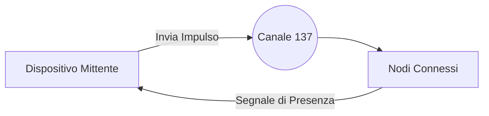
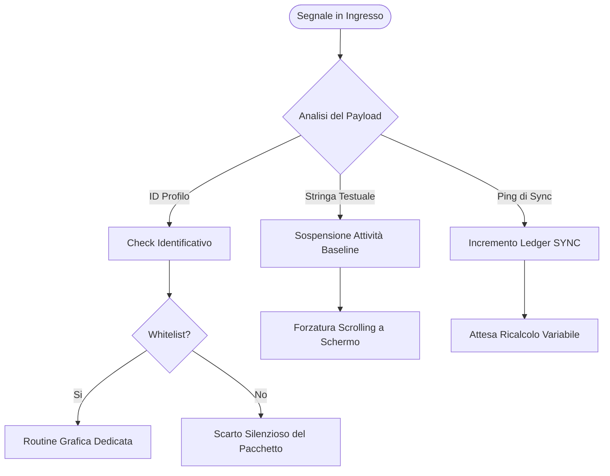
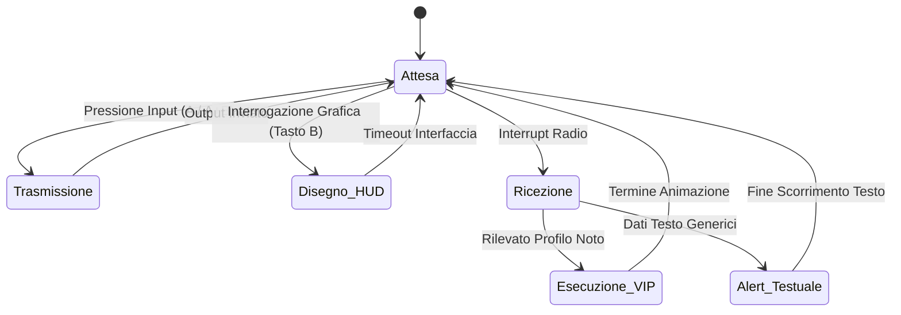
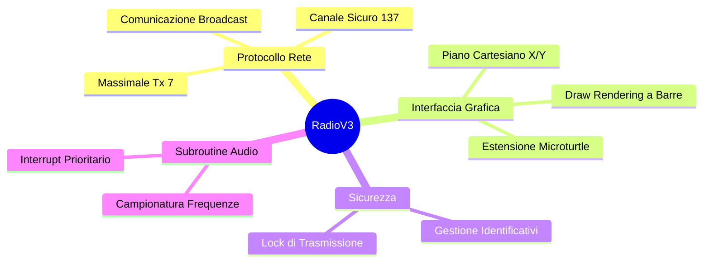

  <h1>MICROBIT RADIO V3</h1>
  
<strong>Protocollo Avanzato di Sincronizzazione e Comunicazione Radio per sistemi embedded.</strong>

  
  

    
    
    
    
    
  

   

  <em>Scambio rapido di messaggi, identificazione visiva dei nodi e quantificazione HUD online.</em>
  

 

---

## Architettura di Rete

Il sistema basa le proprie fondamenta su una topologia di trasmissione broadcast-centrica. Nessun nodo è esclusivamente server; tutti agiscono come *peer* indipendenti all'interno dell'infrastruttura condivisa sul canale.

> [!TIP]
> **Lettura Semplificata:** Il mittente interroga il canale, i dispositivi adiacenti che ascoltano inviano un pacchetto di conferma, garantendo l'aggiornamento costante della conta utenti in tempo reale.

---

## Elaborazione dei Flussi

Quando il protocollo in background rileva una modulazione di frequenza, esegue un "routing" per indirizzare i bit ricevuti alle loro funzioni associate. Questo diagramma di flusso illustra la logica ramificata:

---

## Macchina a Stati del Dispositivo

Il comportamento del software è descrivibile tramite una macchina a stati finiti (FSM). Il micro_bit passa da stato passivo ("Attesa") a stati attivi solo tramite precise condizioni:

---

## Panoramica a Mappa Mentale

Una sintesi radiale dei sotto-settori informatici toccati durante il disegno tecnico del software e delle limitazioni superate in fase di design:

<b>Dettaglio Funzioni Essenziali</b>

 

* **Heads-Up Display (HUD) a Barre**: Rendering a colonne dei LED per contare fisicamente i ritorni (fino a 20).
* **Profilazione e Audio VIP**: Logiche di eccezione per identificativi noti con riproduzione parallela di file `.MIDI` ed icone isolate.
* **Priorità Flusso Stringhe**: Gestione asincrona che costringe a schermo interi buffer testuali prevenendo omissioni di dati.

---

## Controlli Hardware

Mappatura dei pattern di inserimento tramite interattori fisici e relative conseguenze a display.

| Ingresso Fisico | Azione di Rete | Conseguenza sul Display |
| :---: | :--- | :--- |
| <kbd>A</kbd> | Invio Trasmissione Unilaterale | Risoluzione in fade-in dei loghi associati nelle board che accettano il nodo. |
| <kbd>A</kbd> + <kbd>B</kbd> | Interrogazione Broad Globale | Reset e ridisegno scalare della matrice alla conta dei ritorni positivi. |
| <kbd>B</kbd> | Accesso Interfaccia Dati | Rendering in tempo reale delle utenze aggregate via calcoli proporzionali per pixel. |

---

## Moduli MakeCode

Le configurazioni d'ambiente interne (`ptx.json`) si affidano a quattro core esterni.

1. `radio`: Connettività base ad antenna.
2. `microphone`: Interfacciamenti coi segnali input audio ambientali.
3. `radio-broadcast`: Ampliamento del comparto trasmissioni a pacchetto rapido.
4. `microturtle`: Algoritmo a griglia interpolata indispensabile per le funzioni HUD visive di questo protocollo.

---

## Prerequisiti Base per l'Uso

> [!WARNING]
> Condizione vincolante all'esecuzione corretta dell'infrastruttura è l'**abilitazione manuale nel codice sorgente**.

Per fare in modo che la scheda operi correttamente come nodo attivo e possa trasmettere messaggi all'interno del progetto, l'utente *deve* modificare manualmente una specifica variabile identificativa all'interno del codice sorgente di base (configurazione del block TypeScript). 
In mancanza di questo intervento editoriale, la board interpreterà parzialmente la direttiva ed eliminerà la propria interfaccia d'uscita dai cicli generici in radio frequenza.

---

> [!NOTE]
> Progetto compilato, scritto e architettato interamente da **[pgiudici13](https://github.com/pgiudici13)**. 
> Sviluppato per fini di test su interconnessioni hardware e limitazioni di protocollo custom basate su architetture standard e embedded.
